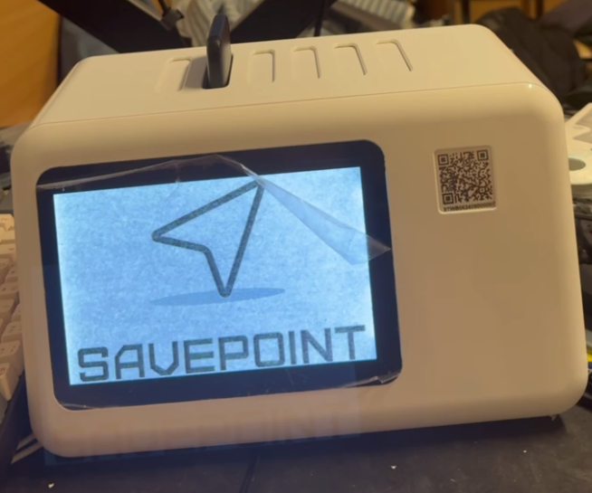
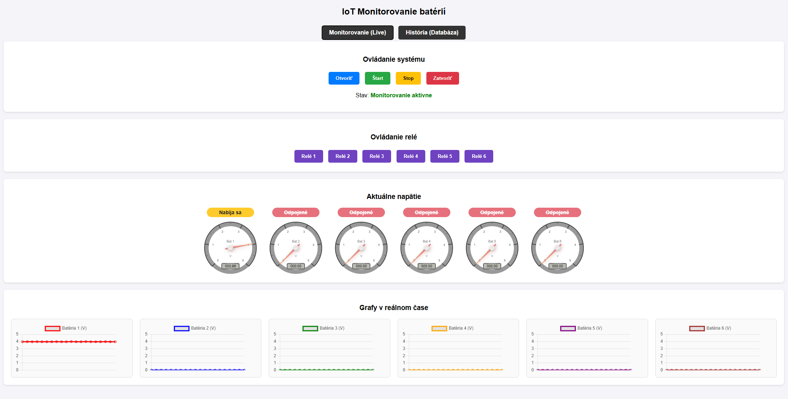
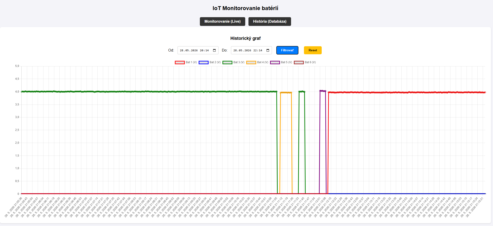

# POIT Semestrálny projekt: IoT Monitorovanie batérií

Vzdialené monitorovanie napätia 6 akumulátorov v reálnom čase s webovou vizualizáciou.

**Živá URL:** [https://shingle-sarcasm-crazily.ngrok-free.dev](https://shingle-sarcasm-crazily.ngrok-free.dev)

---

## Obsah

1. [Popis systému a architektúra](#1-popis-systému-a-architektúra)
2. [Hardvér a zapojenie](#2-hardvér-a-zapojenie)
3. [Odôvodnenie návrhových rozhodnutí](#3-odôvodnenie-návrhových-rozhodnutí)
4. [Technické detaily firmvéru](#4-technické-detaily-firmvéru)
5. [Inštalačný návod](#5-inštalačný-návod)
6. [Konfigurácia servera](#6-konfigurácia-servera)
7. [Formát prenášaných dát](#7-formát-prenášaných-dát)
8. [Prístup k webovému rozhraniu](#8-prístup-k-webovému-rozhraniu)
9. [Vizualizácia a ukladanie dát](#9-vizualizácia-a-ukladanie-dát)

---

## 1. Popis systému a architektúra

Systém meria **elektrické napätie (V)** na šiestich nezávislých batériách (powerbankách) pomocou mikrokontroléra ESP32. Namerané dáta sa každú sekundu odosielajú cez HTTP POST na server bežiaci na **Raspberry Pi 5 (Ubuntu Server)**, kde sa ukladajú do databázy SQLite a vizualizujú na webovom dashboarde prístupnom cez ngrok.

### Architektúra systému

```
┌──────────────────────────────────────────────────────────────┐
│                     ESP32 (mikrokontrolér)                    │
│                                                               │
│  ┌─────────────┐  ADC (6×)  ┌────────────────────────────┐  │
│  │ Batérie 1–6 │ ──────────►│ getStableVoltage()         │  │
│  │  (0 – 5 V)  │            │ 10 vzoriek → sort → avg-6  │  │
│  └─────────────┘            └──────────┬───────────────── ┘  │
│    ↑ Delič R1=5kΩ / R2=10kΩ            │                      │
│      dividerRatio = 0.64               ▼                      │
│                              JSON serializácia                │
│                              HTTP POST /api/data              │
└──────────────────────────────────────────────────────────────┘
                                     │  (LAN)
                                     ▼
┌──────────────────────────────────────────────────────────────┐
│     Python Flask Server – Raspberry Pi 5 (Ubuntu Server)     │
│                        port 5000                              │
│                                                               │
│  POST /api/data  ──► SQLite (measurements.db) + log.csv      │
│                  └──► Flask-SocketIO emit → prehliadač        │
│  GET /api/history ──► SQLite s časovým filtrovaním           │
└──────────────────────────────────────────────────────────────┘
                                     │  (ngrok HTTPS tunel)
                                     ▼
┌──────────────────────────────────────────────────────────────┐
│                    Webový dashboard (HTML/JS)                  │
│  • Live gauges + farebné stavové odznaky                     │
│  • Real-time Chart.js grafy cez WebSocket                    │
│  • Historický graf + tabuľka s filtrovaním podľa dátumu      │
│  • Ovládanie 6× relé (impulz 100 ms)                         │
└──────────────────────────────────────────────────────────────┘
```

### Fotografie a schémy zariadenia


*Schéma zobrazuje ESP32, 6× odporový delič (R1=5 kΩ, R2=10 kΩ), 6× LED, 6× batériu a 8-kanálový relé modul.*

---

## 2. Hardvér a zapojenie

| Komponent | Model / Hodnota | Poznámka |
|-----------|-----------------|----------|
| Mikrokontrolér | ESP32 NodeMCU (ESP-WROOM-32) | Dual-core 240 MHz, Wi-Fi 802.11 b/g/n |
| **Snímač (Kategória B – analógový)** | Odporový delič R1 = 5 kΩ, R2 = 10 kΩ | 6× nezávislý kanál na ADC pinoch |
| Server | **Raspberry Pi 5 (Ubuntu Server 24.04 LTS)** | Hostuje Flask server, SQLite databázu a ngrok tunel |
| Reléový modul | 8-kanálový (SunFounder) | GPIO21–27 |
| LED diódy | 6× štandardná LED | Signalizácia stavu batérie |
| Batérie / powerbanky | 6× testované akumulátory | Monitorované zariadenia |

### Schéma odporového deliča napätia

```
V_batéria ──── R1 (5 kΩ) ──┬──── R2 (10 kΩ) ──── GND
                             │
                          ADC pin ESP32
                          (0 – 3,3 V)
```

**Výpočet deliaceho pomeru:**

`dividerRatio = R2 / (R1 + R2) = 10 000 / (5 000 + 10 000) = 0,667`

**Empirická kalibrácia:** Po porovnaní s referenčným multimetrom bol pomer doladený na `dividerRatio = 0,64` pre kompenzáciu tolerancií rezistorov (±5 %) a vstupnej impedancie ADC prevodníka ESP32.

**Spätný výpočet v kóde firmvéru:**
```cpp
float pinVoltage  = (averageRaw / 4095.0) * 3.3;
float realVoltage = pinVoltage / dividerRatio;  // 0.64
```



---

## 3. Odôvodnenie návrhových rozhodnutí

### 3.1 Platforma – ESP32

ESP32 bola zvolená z nasledujúcich dôvodov:
- Integrovaný Wi-Fi modul (802.11 b/g/n) – bez potreby externého modulu
- Dostatočný výpočtový výkon (dual-core 240 MHz) pre súbežné spracovanie ADC a Wi-Fi
- Dostatočný počet ADC-schopných pinov (GPIO32–39) pre 6 nezávislých kanálov meraní
- Nízka cena, rozsiahla komunita a podpora knižníc

### 3.2 Serverová platforma – Raspberry Pi 5 (Ubuntu Server)

Raspberry Pi 5 s Ubuntu Server 24.04 LTS bolo zvolené ako serverová platforma z nasledujúcich dôvodov:
- **Nízka spotreba energie:** RPi 5 spotrebuje typicky 5–10 W – vhodné pre trvalé nasadenie (24/7)
- **Plnohodnotný Linux:** Ubuntu Server poskytuje natívnu podporu pre Python 3, systemd, pip a všetky potrebné závislosti bez kompromisov
- **Dostatočný výkon:** ARM Cortex-A76 quad-core 2,4 GHz zvládne Flask + SQLite + SocketIO bez degradácie ani pri 1 Hz vzorkovaní 6 kanálov
- **Kompaktnosť a prenosnosť:** Môže byť trvalo nasadený v tesnej blízkosti meraného systému

### 3.3 Programovacie prostredie – Arduino framework (C++)

Arduino framework v prostredí Arduino IDE bol zvolený z nasledujúcich dôvodov:

- **Nízka réžia pri práci s hardvérom:** Priamy prístup k ADC prevodníkovi cez `analogRead()`, rýchle GPIO operácie cez `digitalWrite()` pre 6 relé a 6 LED bez zbytočnej abstrakcie
- **Overené IoT knižnice:** `WiFi.h` a `HTTPClient.h` pre spoľahlivú HTTP komunikáciu; `ArduinoJson.h` pre efektívne parsovanie JSON odpovedí zo servera (príkazy relé, dynamický interval)
- **Jednoduchosť nasadenia:** Nahratie firmvéru jedným kliknutím v Arduino IDE bez potreby CMake, Makefile ani správy build systémov

Alternatíva MicroPython by priniesla vyšší runtime overhead pri ADC operáciách a pomalšie časy vzorkovania – nevhodné pre 10-vzorkovú filtráciu na 6 kanáloch s 20 ms oknom.

### 3.4 Snímač – Odporový delič napätia (Kategória B)

Namiesto I²C/SPI senzora napätia (napr. INA219, INA226 – Kategória A) bol zvolený odporový delič z dôvodu:
- **Škálovateľnosť a cena:** 6 nezávislých kanálov pomocou 12 bežných rezistorov; INA219 by stál 6× viac a vyžadoval správu I²C adresy
- **Jednoduchosť hardvéru:** Žiadna knižnica, žiadna I²C komunikácia – len čítanie ADC
- **Nevýhody kompenzované softvérom:** Tolerancie rezistorov a nelinearita ADC sú kompenzované kalibráciou (`dividerRatio = 0,64`) a filtráciou šumu (10-vzorkový filter s odmietnutím extrémov)

### 3.5 Komunikačný protokol – HTTP REST API

HTTP POST s JSON formátom bol uprednostnený pred MQTT z nasledujúcich dôvodov:
- **Jednoduchosť infraštruktúry:** Nevyžaduje MQTT broker (Mosquitto), menej závislostí a konfigurácie
- **Priame ukladanie:** Flask endpoint prijme dáta a okamžite ich uloží do SQLite v jednej transakci
- **Obojsmernosť v odpovedi:** Server v HTTP odpovedi vracia príkaz pre relé a dynamický interval – bez potreby druhého komunikačného kanálu

MQTT by bol vhodnejší pri škálovaní na desiatky zariadení; pre jedno ESP32 je HTTP plne postačujúci a jednoduchší.

### 3.6 Bezpečnosť – absencia HTTPS na ESP32

Komunikácia ESP32 ↔ Flask prebieha v lokálnej sieti (LAN) bez TLS z dôvodu:
- Obmedzená RAM ESP32 (~300 KB heap free) – TLS handshake si vyžaduje ~80 KB na certifikáty a buffery
- Zvýšená latencia merania pri TLS (handshake ~500–1000 ms) vs. cieľový interval 1 s

Komunikácia obsahuje iba hodnoty napätia batérií – nie sú to citlivé osobné údaje. Externý prístup na webový dashboard je zabezpečený **ngrok šifrovaným HTTPS tunelom** (TLS 1.3), takže dáta prechádzajúce cez verejný internet sú plne chránené.

### 3.7 Databáza – SQLite

SQLite bola zvolená pred alternatívami (PostgreSQL, InfluxDB) z nasledujúcich dôvodov:
- **Bezserverová:** Beží ako knižnica v procese Flask na Raspberry Pi 5, žiadna inštalácia ani správa DB servera
- **Súborová:** Celá databáza = jeden súbor `measurements.db` – triviálne zálohovanie a prenosnosť
- **Kapacita dostačujúca:** 6 metrík × 1 Hz = 21 600 záznamov/hodinu; SQLite zvládne stovky miliónov riadkov bez degradácie pri jednoduchých dotazoch
- **Natívna SQL podpora pre časové filtrovanie:** `WHERE timestamp BETWEEN ? AND ?` – žiadna knižnica navyše

InfluxDB by bola výhodnejšia pri dátových tokoch > 10 000 bodov/s alebo pri potrebe kompresie time-series; pre tento projekt je zbytočne komplexná.

### 3.8 Perióda merania – 1 sekunda

Interval 1 000 ms bol zvolený ako optimálna hodnota pre sledovanie dynamiky nabíjania/vybíjania:
- **Charakter veličiny:** Napätie batérie sa mení pomaly (rádovo mV/minútu pri nabíjaní) – interval 1 s je dostatočne granulárny pre sledovanie trendov bez overkill-u
- **Sieťová záťaž:** 1 HTTP POST/s ≈ ~500 B/s – zanedbateľné pre LAN
- **Plynulosť dashboardu:** 1 s interval zabezpečuje plynulé živé grafy bez jitter-u

Interval je navyše **dynamicky upraviteľný serverom** cez pole `"interval"` v HTTP odpovedi – možno ho zmeniť za behu bez reinštalácie firmvéru.

---

## 4. Technické detaily firmvéru

### 4.1 Filtrácia šumu ADC

Funkcia `getStableVoltage()` implementuje dvojstupňový filter pre potlačenie šumu ADC:

1. Odoberie **10 vzoriek** s 2 ms pauzou medzi vzorkami (spolu ~20 ms na kanál)
2. **Zoradí vzorky** vzostupne (bubble sort)
3. **Odstráni 2 najnižšie a 2 najvyššie** hodnoty (outlier rejection – ochrana pred krátkodobými špikmi)
4. **Priemeruje** zostávajúcich 6 hodnôt

Výsledok: stabilné čítanie s minimálnym šumom aj pri rušivých elektromagnetických podmienkach.

```cpp
// Pseudokód filtrácie
sort(samples, 10);
average = sum(samples[2..7]) / 6;
```

### 4.2 Prahové hodnoty a LED signalizácia

| Stav | Podmienka | LED | Dashboard odznak |
|------|-----------|-----|-----------------|
| Odpojená | `V < 2,9 V` → nastavená na 0,00 V | Vypnutá (HIGH) | 🔴 Červená – „Odpojené" |
| Nabíja sa | `2,9 V ≤ V < 3,9 V` | Bliká 2 Hz (500 ms) | 🟡 Žltá blikajúca – „Nabíja sa" |
| Nabitá | `V ≥ 3,9 V` | Svietí trvale (LOW) | 🟢 Zelená – „Nabitá" |

Rovnaké prahy sú implementované aj vo frontende dashboardu pre farebné kódovanie stavových odznakov.

### 4.3 Obnova Wi-Fi pripojenia

Firmvér kontroluje stav Wi-Fi na začiatku každého cyklu `loop()`:

```cpp
if (WiFi.status() != WL_CONNECTED) {
    WiFi.reconnect();
}
// ...
if (WiFi.status() == WL_CONNECTED) {
    // HTTP POST prebehne iba pri aktívnom spojení
}
```

Pri výpadku siete firmvér **nehavaruje** – meranie ADC a LED signalizácia pokračujú, HTTP POST sa preskočí. Akonáhle sa Wi-Fi obnoví, prenos dát sa automaticky obnoví.

### 4.4 Dynamický interval merania

Server môže upraviť interval merania odpoveďou v poli `interval`:
```json
{ "status": "success", "command": "none", "interval": 5000 }
```

ESP32 aktualizuje `voltInterval` za behu bez nutnosti reštartu.

---

## 5. Inštalačný návod

Tento návod umožňuje tretej osobe zopakovať celý systém od nuly.

### 5.1 Požiadavky

| Nástroj | Verzia | Platforma |
|---------|--------|-----------|
| **Raspberry Pi 5** | Ubuntu Server 24.04 LTS | Serverová platforma |
| Python | 3.10 alebo novší (predinštalovaný v Ubuntu 24.04) | Raspberry Pi 5 |
| pip | aktuálna verzia | Raspberry Pi 5 |
| Arduino IDE | 2.x | vývojový PC |
| ESP32 board support | Espressif ESP32 (cez Board Manager) | Arduino IDE |
| Knižnica ArduinoJson | 6.x (cez Library Manager) | Arduino IDE |
| ngrok | aktuálna verzia (voliteľné pre externý prístup) | Raspberry Pi 5 |

### 5.2 Príprava Raspberry Pi 5 (Ubuntu Server)

```bash
# Aktualizácia systému
sudo apt update && sudo apt upgrade -y

# Inštalácia Pythonu a pip (ak ešte nie sú)
sudo apt install python3 python3-pip -y
```

### 5.3 Spustenie backend servera na Raspberry Pi 5

```bash
# 1. Klonovanie repozitára
git clone https://github.com/Alexmir888/battery-monitor.git
cd battery-monitor

# 2. Inštalácia Python závislostí
pip3 install flask flask-socketio

# 3. Spustenie Flask servera
python3 app.py
```

Server sa spustí na adrese `http://<IP_RPi5>:5000` a automaticky vytvorí databázu `measurements.db`. Webový dashboard je dostupný na tej istej adrese.

> Zistenie IP adresy Raspberry Pi 5: `ip a` (v termináli RPi5) alebo `hostname -I`

### 5.4 Konfigurácia a nahratie firmvéru pre ESP32

**a)** Skopírujte šablónu konfigurácie:
```bash
cp firmware/config.h.example firmware/config.h
```

**b)** Upravte súbor `firmware/config.h` podľa vašej siete:
```cpp
const char* ssid       = "NAZOV_VASEJ_WIFI_SIETE";
const char* password   = "HESLO_VASEJ_WIFI_SIETE";
const char* serverName = "http://IP_ADRESA_RASPBERRY_PI5:5000/api/data";
```

**c)** V Arduino IDE:
- Nainštalujte dosky: **Nástroje → Správca dosiek** → vyhľadajte `ESP32 by Espressif Systems` → Inštalovať
- Nainštalujte knižnicu: **Sketch → Knižnice → Manage** → vyhľadajte `ArduinoJson` → Inštalovať (ver. 6.x)

**d)** Otvorte `firmware/main.ino`, zvoľte:
- **Doska:** `ESP32 Dev Module`
- **Port:** správny COM port (skontrolujte v Správcovi zariadení)

**e)** Nahrajte firmvér tlačidlom **Upload (→)**.

### 5.5 Verejný prístup cez ngrok

```bash
# Na Raspberry Pi 5, v samostatnom termináli (po spustení Flask servera)
ngrok http 5000
```

Skopírujte vygenerovanú HTTPS adresu (napr. `https://xxxx.ngrok-free.dev`). Táto adresa je prístupná odkiaľkoľvek z internetu.

### 5.6 Automatické spustenie po reštarte systému (systemd)

Pre trvalé nasadenie na Raspberry Pi 5 s Ubuntu Server:

```bash
# Vytvorenie service súboru
sudo nano /etc/systemd/system/battery-monitor.service
```

Obsah súboru (upravte cesty podľa vášho prostredia):
```ini
[Unit]
Description=Battery Monitor Flask Server
After=network.target

[Service]
User=pi
WorkingDirectory=/home/pi/battery-monitor
ExecStart=/usr/bin/python3 /home/pi/battery-monitor/app.py
Restart=always
RestartSec=5
StandardOutput=journal
StandardError=journal

[Install]
WantedBy=multi-user.target
```

```bash
# Aktivácia a spustenie služby
sudo systemctl daemon-reload
sudo systemctl enable battery-monitor
sudo systemctl start battery-monitor

# Overenie stavu
sudo systemctl status battery-monitor
```

Systemd konfigurácia zabezpečuje automatické spustenie servera po každom reštarte Raspberry Pi 5.

---

## 6. Konfigurácia servera

Citlivé parametre sú oddelené od kódu:
- **Firmvér:** súbor `firmware/config.h` (nie je súčasťou repozitára, použite `config.h.example` ako šablónu)
- **Server:** beží na Raspberry Pi 5 na adrese `host='0.0.0.0', port=5000` – konfigurovateľné priamo v `app.py`

**Súbor `.gitignore` obsahuje:**
```
firmware/config.h
measurements.db
log.csv
```

### Endpointy servera

| Metóda | Endpoint | Popis |
|--------|----------|-------|
| `POST` | `/api/data` | Príjem dát z ESP32 |
| `GET` | `/api/history` | Historické dáta (parametre `start`, `end` v UNIX čase) |
| `GET` | `/` | Webový dashboard |
| `WS` | `socket.io` | Real-time komunikácia s dashboardom |

---

## 7. Formát prenášaných dát

### ESP32 → Server (POST `/api/data`)

```json
{
  "v1": 4.12,
  "v2": 3.85,
  "v3": 0.00,
  "v4": 4.20,
  "v5": 3.90,
  "v6": 1.20
}
```

- Hodnota `0.00` znamená odpojená/vybitá batéria.
- Odosielané každú 1 sekundu (1 000 ms)

### Server → ESP32 (HTTP odpoveď)

```json
{ "status": "success", "command": "none" }
```

Pri príkaze relé z dashboardu:
```json
{ "status": "success", "command": "3" }
```

ESP32 reaguje impulzom 100 ms na relé č. 3 (`digitalWrite(relayPins[2], LOW)` → 100 ms → `HIGH`).

### Databázová schéma (SQLite)

```sql
CREATE TABLE log (
  id        INTEGER PRIMARY KEY AUTOINCREMENT,
  timestamp REAL,    -- UNIX timestamp (time.time())
  v1 REAL, v2 REAL, v3 REAL, v4 REAL, v5 REAL, v6 REAL
);
```

---

## 8. Prístup k webovému rozhraniu

**Živá URL:** [https://shingle-sarcasm-crazily.ngrok-free.dev](https://shingle-sarcasm-crazily.ngrok-free.dev)

*(Pre nové nasadenie: spustite `ngrok http 5000` na Raspberry Pi 5 a použite vygenerovanú adresu)*

QR kód pre rýchly prístup zo smartfónu počas obhajoby:


---

## 9. Vizualizácia a ukladanie dát

Backend využíva **Flask-SocketIO** pre prenos dát do prehliadača v reálnom čase bez obnovovania stránky.

### Záložka: Monitorovanie (Live)

- **Ovládanie systému:** štyri stavy – Otvoriť / Štart / Stop / Zatvoriť
- **Ovládanie relé:** 6× tlačidlo – generuje impulz 100 ms (nabíjací cyklus)
- **Gauges (RadialGauge):** 6× analógový ukazovateľ, rozsah 0–5 V
- **Farebné stavové odznaky** (farebné kódovanie podľa prahov):
  - 🟢 **Nabitá** – `V ≥ 4,0 V` (zelená)
  - 🟡 **Nabíja sa** – `0,5 V ≤ V < 4,0 V` (žltá, animované blikanie)
  - 🔴 **Odpojené** – `V < 0,5 V` (červená, preškrtnuté)
- **Live grafy:** 6× Chart.js, posuvné okno posledných 20 meraní

### Záložka: História (Databáza)

- **Historický graf:** všetkých 6 batérií súčasne, farebne odlíšené
- **Časový filter:** výber rozsahu „Od – Do" (datetime-local input)
- **Tabuľka dát:** záznamy zoradené zostupne, napätie na 2 desatinné miesta
- Predvolene sa načíta posledných 50 záznamov

### Ukladanie dát

- **SQLite** (`measurements.db`): primárna databáza na Raspberry Pi 5, každý záznam = UNIX timestamp + 6× napätie
- **CSV** (`log.csv`): paralelný export pre spracovanie v Exceli alebo Pythone

### Snímky obrazovky



*Hlavná obrazovka: stavové odznaky, gauges a live grafy*



*Záložka História: časový filter a historický graf*

---
